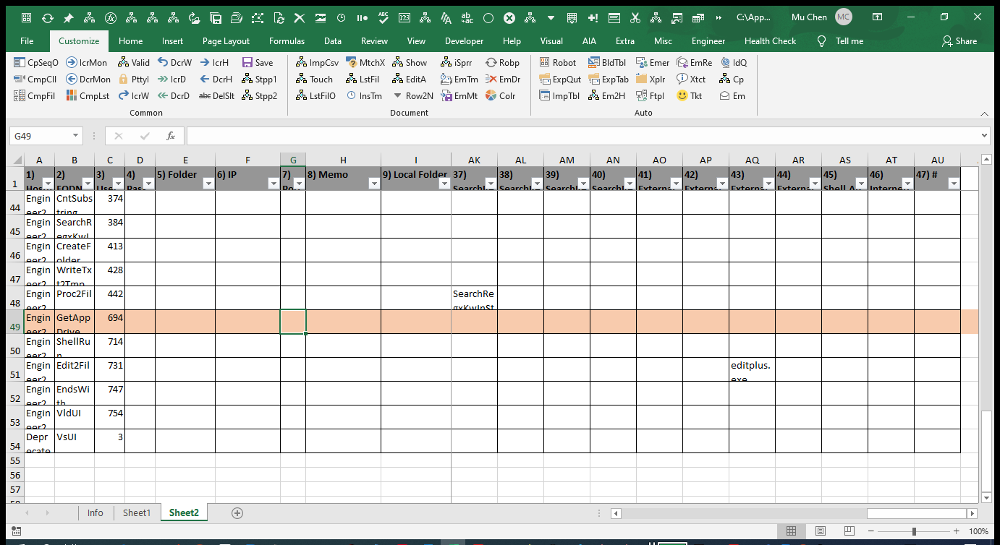
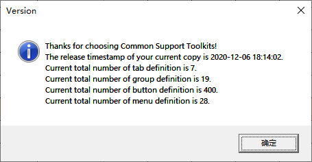

# cst
common support toolkits

InitMethod --> get drive 因为需要一个非本地硬盘备份重要的 excel 文件，还包含一个重写的 msgbox 和 questionbox 去实现一些信息告知以及可选择的分支。

SetupMethod1 --> 从0到1创建一个通用的 excel template, 然后通过这个基本的模板实现一些电脑操作的流程化，可视化和自动化。例如本地命令，远程命令，文件，邮件，数据库等等。

SetupMethod2 --> 当excel文档打开和关闭时，简单实现一个基本的 version control，保证文档的有序改动。

SetupMethod3 --> 包含实现自动化的关键代码。

Engineer1 --> 对之前的代码及未来的代码实现回归测试，预先发现一些人为的错误在发布之前。

Engineer2 --> 收集一些代码信息针对未来的优化和迭代。

<<<<<<< HEAD

=======

附上一些图片也许更直观一些

>>>>>>> 139f6b220b221c78f566b9e24120414894ed3ec9
